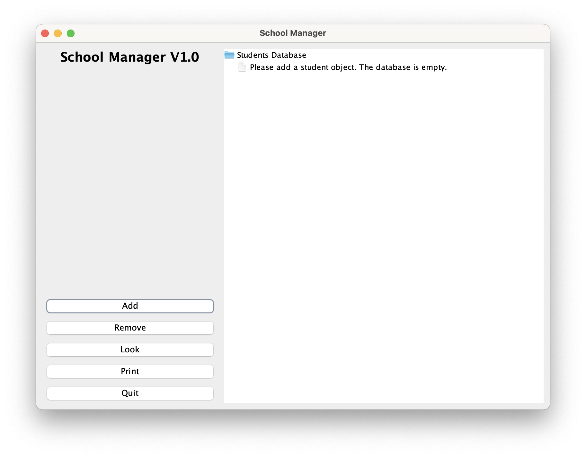
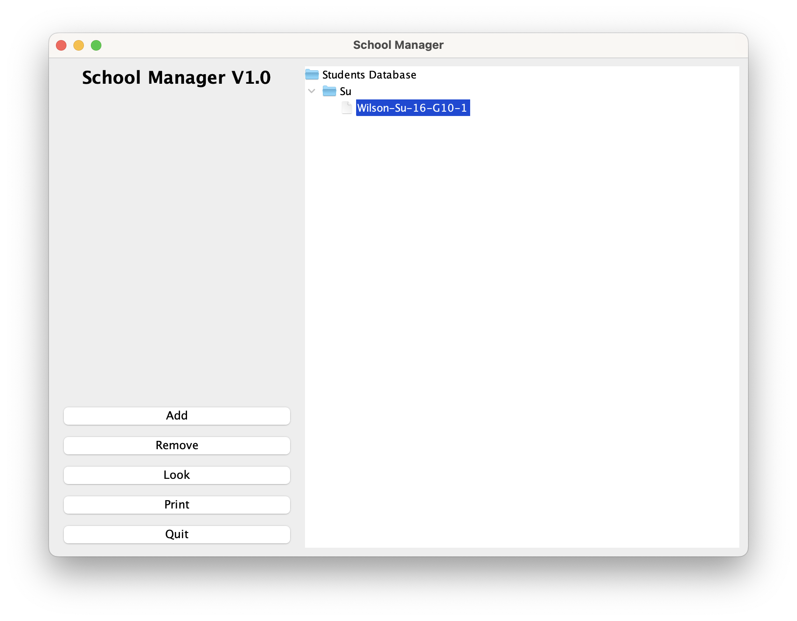
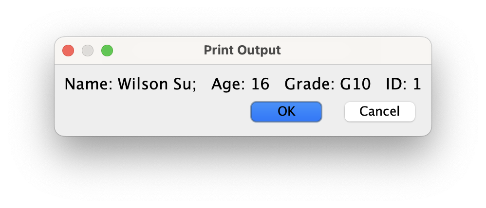

# School Manager Java Executable
## Introduction
The School Manager Java Executable is made primarily using Java Swing as its UI Application framework, with user-friendly
UI actions and operations that eases the entire managing process, compared to a traditional CLI Application.

## UI/UX

The UI, due to the limitations with the Java Swing Framework (Extremely Old), is aesthetically limited. However, the UI 
of this application is designed with user-friendly operations in mind, with a clean, sleek, and direct interface and a 
tree-based hierarchy view on the right displayed in a large portion on the screen that directly gives insight to the student database.

## Usage
The School Manager Java Executable has four major functions: Add, Remove, Lookup, and Print.
-	The Add function adds in new Student Entries into the database itself.
-	The Remove function removes an existing Student Entry within the database itself. If the lookup entry does not exist, it will provide an error dialog.
-	The Lookup function allows users to quickly find students by their surname or ID. If the lookup entry does not exist, it will provide an error dialog.
-	The Print function directly prints the student info on screen with a dialog. If the selected entry does not exist, it will provide an error dialog.

## Using the Functions
 
By clicking on the “Add” button, a dialog shown above will pop out. In this dialog, you will be able to fill in the new 
student’s information and confirm to add it into the database. Do keep in mind that all fields are Nullable and the 
database itself is a non-unique entry database, so duplicates of students may be added.

By clicking on the “Remove” or the “Look” button, a dialog shown above will pop out. In this dialog shows two fields: “Search by Surname” and “Search by ID.”
* To Remove a student from the Database, simply enter the surname and/or the ID of the student you want to remove. Upon pressing OK, if the student exists within the database, the student will be removed and the tree view will be updated.
* To Look for a student from the Database, simply enter the surname and/or the ID of the student you want to look up. Upon pressing OK, if the student is found, it will automatically select that student within the tree view. If not, an error dialog will pop out.

* To print out a student’s information, select a student entry in the tree hierarchy view and then press the “Print” button.

After pressing the print button, it will pop up a dialog:


This dialog shows the student print output formatted in a more readable way.
If you press the print button without selecting a student entry, an error dialog will pop up.

## Technical Details
### Frameworks
For starters, I went for the Java Swing UI Framework, which provides me a lot of maneuverability to start my code with. 
Due to its old codebase framework, yet simple, it is fast, easy-to-build, and multiplatform, which makes it a good 
first-choice to go to.

For the database itself, the entire database can be represented by the Roster class, which is a class that has an 
ArrayList of students and other utility methods. The student entries can be represented by the Student class, which as 
the attributes name, surname, grade, id, and age.
```java
import java.util.ArrayList;
import java.util.concurrent.atomic.AtomicBoolean;
import java.util.concurrent.atomic.AtomicInteger;

public class Roster {
    public Roster(){
        myRoster = new ArrayList<>();
    }

    public Roster(ArrayList<Student> students){
        myRoster = students;
    }

    private ArrayList<Student> myRoster = new ArrayList<>();

    public ArrayList<Student> getMyRoster() {
        return myRoster;
    }

    public void setMyRoster(ArrayList<Student> myRoster) {
        this.myRoster = myRoster;
    }

    public Roster addRoster(Student student){
        if(!myRoster.contains(student))
            myRoster.add(student);
        return this;
    }

    public boolean removeRoster(Student student){
        return myRoster.remove(student);
    }

    public boolean removeRoster(String surname){
        return myRoster.remove(lookForRoster(surname));
    }

    public boolean removeRoster(int id){
        return myRoster.remove(lookForRoster(id));
    }

    public Student lookForRoster(String surname){
        AtomicInteger success = new AtomicInteger(-1);
        myRoster.forEach(i -> {
            if(i.getSurname().equals(surname)) {
                success.set(myRoster.indexOf(i));
            }
        });
        return success.get() == -1 ? null : myRoster.get(success.get());
    }

    public Student lookForRoster(int id){
        AtomicInteger success = new AtomicInteger(-1);
        myRoster.forEach(i -> {
            if(i.getId() == id) {
                success.set(myRoster.indexOf(i));
            }
        });
        return success.get() == -1 ? null : myRoster.get(success.get());
    }

    public Roster printRoster(String surname){
        myRoster.forEach(i -> {
            if (i.getSurname().equals(surname)){
                System.out.println(i);
                return;
            }
        });
        return this;
    }

    public Roster printRoster(int id){
        myRoster.forEach(i -> {
            if (i.getId() == id){
                System.out.println(i);
                return;
            }
        });
        return this;
    }

    public Roster printAll(){
        myRoster.forEach(System.out::println);
        return this;
    }
}
```

The above is the Roster.java file that contains the Roster class and all of its methods.
```java
public class Student {
    private String name, surname, grade;
    private int age, id;

    public Student(String name, String surname, String grade, int age, int id) {
        this.name = name;
        this.surname = surname;
        this.grade = grade;
        this.age = age;
        this.id = id;
    }

    @Override
    public String toString() {
        return String.format("%s-%s-%s-%s-%s", getName(), getSurname(), getAge(), getGrade(), getId());
    }

    public static String parseFromString(String str) {
        String[] parts = str.split("-");
        return String.format("Name: %s;   Age: %s   Grade: %s   ID: %s", parts[0] + " " + parts[1], parts[2], parts[3], parts[4]);
    }

    public String toProperString() {
        return parseFromString(toString());
    }

    public String getName() {
        return name;
    }

    public void setName(String name) {
        this.name = name;
    }

    public String getSurname() {
        return surname;
    }

    public void setSurname(String surname) {
        this.surname = surname;
    }

    public String getGrade() {
        return grade;
    }

    public void setGrade(String grade) {
        this.grade = grade;
    }

    public int getAge() {
        return age;
    }

    public void setAge(int age) {
        this.age = age;
    }

    public int getId() {
        return id;
    }

    public void setId(int id) {
        this.id = id;
    }

    @Override
    public boolean equals(Object o) {
        if (this == o) return true;
        if (o == null || getClass() != o.getClass()) return false;
        Student student = (Student) o;
        return age == student.age &&
                id == student.id &&
                name != null ? name.equals(student.name) : student.name != null &&
                surname != null ? surname.equals(student.surname) : student.surname == null &&
                grade.equals(student.grade);
    }
}
```

The above is the Student.java file which contains the Student class.
Both classes contained getters and setters for the attributes, while the Roster class has more utility methods such as the overloaded lookup methods.

## Instructions
Running the executable:
1.	Download JDK 20
2.	Double click the jar executable “FinalProjectExecutable_DoubleClickToRunMe.jar”
***
Running via source code:
1.	Download JDK 20
2.	Unzip the source code zip file
3.	Go into the source folder and run Main.java using JetBrains IntelliJ IDEA, or build it using Gradle or Maven

